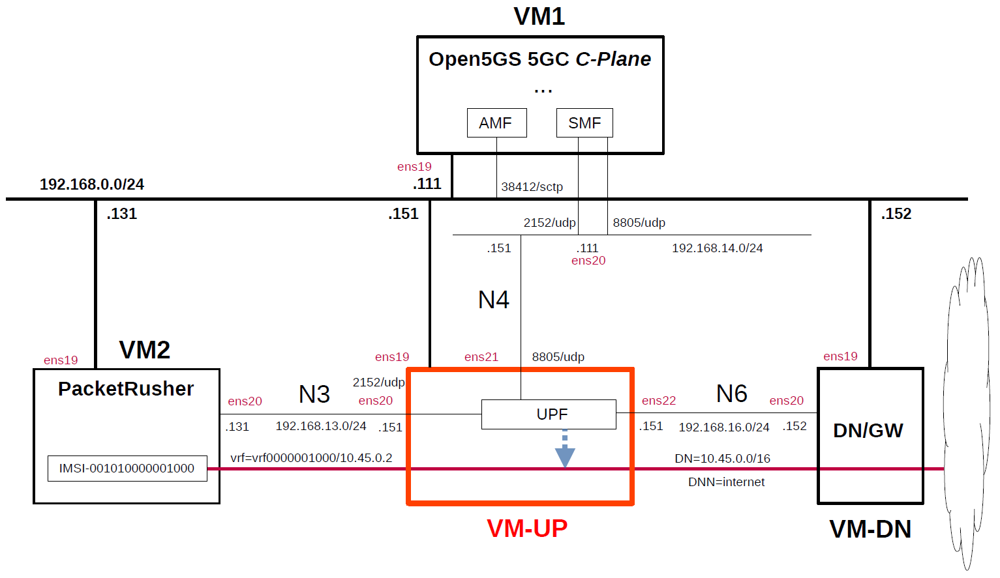

# Simple Measurement of UPF Performance 4
This describes simple performance measurements of several open source UPFs by using [PacketRusher](https://github.com/HewlettPackard/PacketRusher) as the performance measurement tool.
For this measurement, VMs in the measurement environment was changed from Virtualbox used in [previous measurement](https://github.com/s5uishida/simple_measurement_of_upf_performance) to Proxmox VE.
For other measurement results, please see [Miscellaneous](https://github.com/s5uishida/sample_config_misc_for_mobile_network#misc).
PacketRusher is also featured on [HPE Developer Blog](https://developer.hpe.com/blog/open-sourcing-packetrusher-a-5g-core-performance-tester/).

**Note. This is a very simple measurement, and according to [this comment](https://github.com/open5gs/open5gs/discussions/1780#discussioncomment-10853290), it doesn't seem to make much sense to measure between VMs. I hope it will serve as a reference for a simple configuration when measuring on real devices.**

---

### [Sample Configurations and Miscellaneous for Mobile Network](https://github.com/s5uishida/sample_config_misc_for_mobile_network)

---

<a id="toc"></a>

## Table of Contents

- [Simple Overview of UPF Performance Measurements](#overview)
- [Changes in configuration files of Open5GS, free5GC, UPFs and PacketRusher](#changes)
  - [Changes in configuration files of Open5GS 5GC C-Plane](#changes_cp_open5gs)
  - [Changes in configuration files of free5GC 5GC C-Plane](#changes_cp_free5gc)
  - [Changes in configuration files of UPFs](#changes_up)
    - [a-1. Changes in configuration files of Open5GS 5GC UPF (TUN)](#changes_up_a1)
    - [a-2. Changes in configuration files of Open5GS 5GC UPF (TAP)](#changes_up_a2)
    - [b. Changes in configuration files of UPG-VPP](#changes_up_b)
    - [c. Changes in configuration files of eUPF](#changes_up_c)
    - [d. Changes in configuration files of free5GC 5GC UPF](#changes_up_d)
  - [Changes in configuration files of PacketRusher](#changes_pr)
- [Network settings of UPFs and Data Network Gateway](#network_settings)
  - [a-1. Network settings of Open5GS 5GC UPF (TUN)](#network_settings_up_a1)
  - [a-2. Network settings of Open5GS 5GC UPF (TAP)](#network_settings_up_a2)
  - [b. Network settings of UPG-VPP](#network_settings_up_b)
  - [c. Network settings of eUPF](#network_settings_up_c)
  - [d. Network settings of free5GC 5GC UPF](#network_settings_up_d)
  - [Network settings of Data Network Gateway](#network_settings_dn)
- [Build Open5GS, free5GC, UPFs and PacketRusher](#build)
- [Run Open5GS, free5GC and UPFs](#run)
  - [Run UPFs](#run_up)
    - [a-1. Run Open5GS 5GC UPF (TUN)](#run_up_a1)
    - [a-2. Run Open5GS 5GC UPF (TAP)](#run_up_a2)
    - [b. Run UPG-VPP](#run_up_b)
    - [c. Run eUPF](#run_up_c)
    - [d. Run free5GC 5GC UPF](#run_up_d)
  - [Run 5GC C-Plane](#run_cp)
    - [Run Open5GS 5GC C-Plane](#run_cp_open5gs)
    - [Run free5GC 5GC C-Plane](#run_cp_free5gc)
- [Measure using PacketRusher](#measure)
  - [Run PacketRusher on VM2](#run_packet_rusher)
  - [Run iPerf3 server on Data Network Gateway (VM-DN)](#run_iperf3_server)
  - [Try ping and iPerf3 client on VM2](#try_ping_iperf3)
- [Results](#results)
  - [Connected to Open5GS C-Plane](#connect_open5gs)
  - [Connected to free5GC C-Plane](#connect_free5gc)
  - [Summary](#summary)
  - [Performance of N6 interface only](#n6_performance)
- [Changelog (summary)](#changelog)

---

<a id="overview"></a>

## Simple Overview of UPF Performance Measurements

Using Open5GS for 5GC, I will easily measure the performance of several open source UPFs with PacketRusher.
**Note that this configuration is implemented with Proxmox VE VMs.**

The following minimum configuration was set as a condition.
- Only one each for C-Plane, U-Plane(UPF) and RAN&UE(performance measurement tool).

The built simulation environment is as follows.

</img>

The 5GC / RAN&UE used are as follows.

- 5GC - Open5GS v2.7.2 (2024.10.11) - https://github.com/open5gs/open5gs  
  *for Open5GS UPF, UPG-VPP and eUPF*
- 5GC - free5GC v3.4.3 (2024.10.11) - https://github.com/free5gc/free5gc  
  *for free5GC UPF (go-upf)*
- RAN&UE - PacketRusher 20240521 (2024.06.24) - https://github.com/HewlettPackard/PacketRusher  
  (RAN) - gtp5g v0.9.2 (2024.10.11) - https://github.com/free5gc/gtp5g

The UPFs used are as follows.

- Open5GS v2.7.2 (2024.10.11) - https://github.com/open5gs/open5gs
- UPG-VPP v1.13.0 (2024.03.25) - https://github.com/travelping/upg-vpp
- eUPF v0.6.4 (2024.05.01) - https://github.com/edgecomllc/eupf
- free5GC UPF (go-upf) v1.2.3 (2024.10.11) - https://github.com/free5gc/go-upf  
  gtp5g v0.8.10 (2024.06.03) - https://github.com/free5gc/gtp5g

Each VMs are as follows.
| VM | SW & Role | IP address | OS | CPU | Mem | HDD |
| --- | --- | --- | --- | --- | --- | --- |
| VM1 | Open5GS 5GC C-Plane | 192.168.0.111/24 | Ubuntu 24.04 | 1 | 2GB | 20GB |
| **VM-UP** | **each UPF U-Plane**  | **192.168.0.151/24** | **Ubuntu 24.04<br>or 22.04** | **2** | **8GB** | **20GB** |
| VM-DN | Data Network Gateway  | 192.168.0.152/24 | Ubuntu 24.04 | 2 | 2GB | 10GB |
| VM2 | PacketRusher RAN&UE | 192.168.0.131/24 | Ubuntu 24.04 | 2 | 2GB | 10GB |

**Each VM-UP(UPFs) are as follows.**
| # | SW | Date | Commit | OS |
| --- | --- | --- | --- | --- |
| a | Open5GS UPF v2.7.2 | 2024.10.11 | `606788361cb2255961f856de17d71c6b2fc86847` | Ubuntu 24.04 |
| b | UPG-VPP v1.13.0 | 2024.03.25 | `dfdf64000566d35955d7c180720ff66086bd3572` | Ubuntu 22.04 |
| c | eUPF v0.6.4 | 2024.05.01 | `0f704deaca67766733a447f4680cf4d77e638934` | Ubuntu 24.04 |
| d | free5GC UPF<br>(go-upf) v1.2.3 | 2024.10.11 | `6b73d126b8b29b4d17ff744c31ef50634ee64164` | Ubuntu 24.04 |

The network interfaces of each VM except VM-UP are as follows.
| VM | Device | Model | Linux Bridge | IP address | Interface |
| --- | --- | --- | --- | --- | --- |
| VM1 | ens18 | VirtIO | vmbr1 | 10.0.0.111/24 | (NAPT NW) |
| | ens19 | VirtIO | mgbr0 | 192.168.0.111/24 | (Mgmt NW) |
| | ens20 | VirtIO | vmbr4 | 192.168.14.111/24 | N4 |
| VM-DN | ens18 | VirtIO | vmbr1 | 10.0.0.152/24 | (NAPT NW) |
| | ens19 | VirtIO | mgbr0 | 192.168.0.152/24 | (Mgmt NW) |
| | ens20 | VirtIO | vmbr6 | 192.168.16.152/24 | N6 ***(default GW for VM-UP)*** |
| VM2 | ens18 | VirtIO | vmbr1 | 10.0.0.131/24 | (NAPT NW) |
| | ens19 | VirtIO | mgbr0 | 192.168.0.131/24 | (Mgmt NW) |
| | ens20 | VirtIO | vmbr3 | 192.168.13.131/24 | N3 |

**The network interfaces of each VM-UP(UPFs) are as follows.**
**Note that UPFs from `a` to `c` connect to Open5GS CN, but `d` free5GC UPF does not support FTUP flag in PFCP Association Setup Request/Respose, so it connects to free5GC CN.**
| # | SW | Device | Model | Linux Bridge | IP address | Interface |
| --- | --- | --- | --- | --- | --- | --- |
| a | Open5GS UPF | ~~ens18~~ | ~~VirtIO~~ | ~~vmbr1~~ | ~~10.0.0.151/24~~ | ~~(NAPT NW)~~ ***down*** |
| | | ens19 | VirtIO | mgbr0 | 192.168.0.151/24 | (Mgmt NW) |
| | | ens20 | VirtIO | vmbr3 | 192.168.13.151/24 | N3 |
| | | ens21 | VirtIO | vmbr4 | 192.168.14.151/24 | N4 |
| | | ens22 | VirtIO | vmbr6 | 192.168.16.151/24 | N6 |
| b | UPG-VPP | ens18 | VirtIO | vmbr1 | 10.0.0.151/24 | (NAPT NW) |
| | | ens19 | VirtIO | mgbr0 | 192.168.0.151/24 | (Mgmt NW) |
| | | ens20 | VirtIO | vmbr3 | 192.168.13.151/24 | N3 ***(Under DPDK by vfio-pci)*** |
| | | ens21 | VirtIO | vmbr4 | 192.168.14.151/24 | N4 ***(Under DPDK by vfio-pci)*** |
| | | ens22 | VirtIO | vmbr6 | 192.168.16.151/24 | N6 ***(Under DPDK by vfio-pci)*** |
| c | eUPF | ~~ens18~~ | ~~VirtIO~~ | ~~vmbr1~~ | ~~10.0.0.151/24~~ | ~~(NAPT NW)~~ ***down*** |
| | | ens19 | VirtIO | mgbr0 | 192.168.0.151/24 | (Mgmt NW) |
| | | ens20 | VirtIO | vmbr3 | 192.168.13.151/24 | N3 ***(XDP)*** |
| | | ens21 | VirtIO | vmbr4 | 192.168.14.151/24 | N4 |
| | | ens22 | VirtIO | vmbr6 | 192.168.16.151/24 | N6 ***(XDP)*** |
| d | free5GC UPF<br>(go-upf) | ~~ens18~~ | ~~VirtIO~~ | ~~vmbr1~~ | ~~10.0.0.151/24~~ | ~~(NAPT NW)~~ ***down*** |
| | | ens19 | VirtIO | mgbr0 | 192.168.0.151/24 | (Mgmt NW) |
| | | ens20 | VirtIO | vmbr3 | 192.168.13.151/24 | N3 |
| | | ens21 | VirtIO | vmbr4 | 192.168.14.151/24 | N4 |
| | | ens22 | VirtIO | vmbr6 | 192.168.16.151/24 | N6 |

Linux Bridges of Proxmox VE are as follows.
| Linux Bridge | Network CIDR | Interface |
| --- | --- | --- |
| vmbr1 | 10.0.0.0/24 | NAPT NW |
| mgbr0 | 192.168.0.0/24 | Mgmt NW |
| vmbr3 | 192.168.13.0/24 | N3 |
| vmbr4 | 192.168.14.0/24 | N4 |
| vmbr6 | 192.168.16.0/24 | N6 |

The main subscriber Information is as follows.
Please register the subscriber information on each WebConsole of Open5GS and free5GC.
| IMSI | DNN | DN | Key & OPc | S-NSSAI |
| --- | --- | --- | --- | --- |
| 001010000001000 | internet | 10.45.0.0/16 | `Key:465B5CE8B199B49FAA5F0A2EE238A6BC`<br>`OPc:E8ED289DEBA952E4283B54E88E6183CA` | SST:1<br>SD:010203|

<a id="changes"></a>

## Changes in configuration files of Open5GS, free5GC, UPFs and PacketRusher

Please refer to the following for building Open5GS, free5GC, UPFs and PacketRusher respectively.
- Open5GS v2.7.2 (2024.10.11) - https://open5gs.org/open5gs/docs/guide/02-building-open5gs-from-sources/
- free5GC v3.4.3 (2024.10.11) - https://free5gc.org/guide/
- UPG-VPP v1.13.0 (2024.03.25) - https://github.com/s5uishida/install_vpp_upf_dpdk#annex_1
- eUPF v0.6.4 (2024.05.01) - https://github.com/s5uishida/install_eupf
- free5GC UPF (go-upf) v1.2.3 (2024.10.11) - https://free5gc.org/guide/
- PacketRusher 20240521 (2024.06.24) - https://github.com/HewlettPackard/PacketRusher/wiki

<a id="changes_cp_open5gs"></a>

### Changes in configuration files of Open5GS 5GC C-Plane

- `open5gs/install/etc/open5gs/amf.yaml`
```diff
--- amf.yaml.orig       2024-05-11 22:43:06.000000000 +0900
+++ amf.yaml    2024-05-31 19:06:09.171978977 +0900
@@ -20,29 +20,32 @@
         - uri: http://127.0.0.200:7777
   ngap:
     server:
-      - address: 127.0.0.5
+      - address: 192.168.0.111
   metrics:
     server:
       - address: 127.0.0.5
         port: 9090
   guami:
     - plmn_id:
-        mcc: 999
-        mnc: 70
+        mcc: 001
+        mnc: 01
       amf_id:
         region: 2
         set: 1
   tai:
     - plmn_id:
-        mcc: 999
-        mnc: 70
+        mcc: 001
+        mnc: 01
       tac: 1
   plmn_support:
     - plmn_id:
-        mcc: 999
-        mnc: 70
+        mcc: 001
+        mnc: 01
       s_nssai:
         - sst: 1
+          sd: 1
+        - sst: 1
+          sd: 010203
   security:
     integrity_order : [ NIA2, NIA1, NIA0 ]
     ciphering_order : [ NEA0, NEA1, NEA2 ]
```
- `open5gs/install/etc/open5gs/nrf.yaml`
```diff
--- nrf.yaml.orig       2024-05-11 22:43:06.000000000 +0900
+++ nrf.yaml    2024-05-12 03:26:28.737595527 +0900
@@ -11,8 +11,8 @@
 nrf:
   serving:  # 5G roaming requires PLMN in NRF
     - plmn_id:
-        mcc: 999
-        mnc: 70
+        mcc: 001
+        mnc: 01
   sbi:
     server:
       - address: 127.0.0.10
```
- `open5gs/install/etc/open5gs/smf.yaml`
```diff
--- smf.yaml.orig       2024-06-01 00:21:43.876916232 +0900
+++ smf.yaml    2024-05-12 03:30:16.250185155 +0900
@@ -20,16 +20,13 @@
         - uri: http://127.0.0.200:7777
   pfcp:
     server:
-      - address: 127.0.0.4
+      - address: 192.168.14.111
     client:
       upf:
-        - address: 127.0.0.7
-  gtpc:
-    server:
-      - address: 127.0.0.4
+        - address: 192.168.14.151
   gtpu:
     server:
-      - address: 127.0.0.4
+      - address: 192.168.14.111
   metrics:
     server:
       - address: 127.0.0.4
@@ -37,20 +34,17 @@
   session:
     - subnet: 10.45.0.0/16
       gateway: 10.45.0.1
-    - subnet: 2001:db8:cafe::/48
-      gateway: 2001:db8:cafe::1
+      dnn: internet
   dns:
     - 8.8.8.8
     - 8.8.4.4
-    - 2001:4860:4860::8888
-    - 2001:4860:4860::8844
   mtu: 1400
 #  p-cscf:
 #    - 127.0.0.1
 #    - ::1
 #  ctf:
 #    enabled: auto   # auto(default)|yes|no
-  freeDiameter: /root/open5gs/install/etc/freeDiameter/smf.conf
+#  freeDiameter: /root/open5gs/install/etc/freeDiameter/smf.conf
 
 ################################################################################
 # SMF Info
```

<a id="changes_cp_free5gc"></a>

### Changes in configuration files of free5GC 5GC C-Plane

- `free5gc/config/amfcfg.yaml`
```diff
--- amfcfg.yaml.orig    2024-10-14 05:09:24.379203731 +0900
+++ amfcfg.yaml 2024-10-14 05:59:21.011914287 +0900
@@ -5,7 +5,7 @@
 configuration:
   amfName: AMF # the name of this AMF
   ngapIpList:  # the IP list of N2 interfaces on this AMF
-    - 127.0.0.18
+    - 192.168.0.111
   ngapPort: 38412 # the SCTP port listened by NGAP
 
   # Service-based Interface (SBI) Configuration
@@ -30,22 +30,22 @@
   servedGuamiList:
     # <GUAMI> = <MCC><MNC><AMF ID>
     - plmnId: # Public Land Mobile Network ID, <PLMN ID> = <MCC><MNC>
-        mcc: 208 # Mobile Country Code (3 digits string, digit: 0~9)
-        mnc: 93 # Mobile Network Code (2 or 3 digits string, digit: 0~9)
+        mcc: 001 # Mobile Country Code (3 digits string, digit: 0~9)
+        mnc: 01 # Mobile Network Code (2 or 3 digits string, digit: 0~9)
       amfId: cafe00 # AMF identifier (3 bytes hex string, range: 000000~FFFFFF)
 
   # the TAI (Tracking Area Identifier) list supported by this AMF
   supportTaiList:
     - plmnId: # Public Land Mobile Network ID, <PLMN ID> = <MCC><MNC>
-        mcc: 208 # Mobile Country Code (3 digits string, digit: 0~9)
-        mnc: 93 # Mobile Network Code (2 or 3 digits string, digit: 0~9)
+        mcc: 001 # Mobile Country Code (3 digits string, digit: 0~9)
+        mnc: 01 # Mobile Network Code (2 or 3 digits string, digit: 0~9)
       tac: 000001 # Tracking Area Code (3 bytes hex string, range: 000000~FFFFFF)
 
   # the PLMNs (Public land mobile network) list supported by this AMF
   plmnSupportList:
     - plmnId: # Public Land Mobile Network ID, <PLMN ID> = <MCC><MNC>
-        mcc: 208 # Mobile Country Code (3 digits string, digit: 0~9)
-        mnc: 93 # Mobile Network Code (2 or 3 digits string, digit: 0~9)
+        mcc: 001 # Mobile Country Code (3 digits string, digit: 0~9)
+        mnc: 01 # Mobile Network Code (2 or 3 digits string, digit: 0~9)
       snssaiList: # the S-NSSAI (Single Network Slice Selection Assistance Information) list supported by this AMF
         - sst: 1 # Slice/Service Type (uinteger, range: 0~255)
           sd: 010203 # Slice Differentiator (3 bytes hex string, range: 000000~FFFFFF)
```
- `free5gc/config/ausfcfg.yaml`
```diff
--- ausfcfg.yaml.orig   2024-09-01 09:47:28.519041774 +0900
+++ ausfcfg.yaml        2024-09-01 09:55:53.372615743 +0900
@@ -16,10 +16,8 @@
   nrfUri: http://127.0.0.10:8000 # a valid URI of NRF
   nrfCertPem: cert/nrf.pem # NRF Certificate
   plmnSupportList: # the PLMNs (Public Land Mobile Network) list supported by this AUSF
-    - mcc: 208 # Mobile Country Code (3 digits string, digit: 0~9)
-      mnc: 93  # Mobile Network Code (2 or 3 digits string, digit: 0~9)
-    - mcc: 123 # Mobile Country Code (3 digits string, digit: 0~9)
-      mnc: 45  # Mobile Network Code (2 or 3 digits string, digit: 0~9)
+    - mcc: 001 # Mobile Country Code (3 digits string, digit: 0~9)
+      mnc: 01  # Mobile Network Code (2 or 3 digits string, digit: 0~9)
   groupId: ausfGroup001 # ID for the group of the AUSF
   eapAkaSupiImsiPrefix: false # including "imsi-" prefix or not when using the SUPI to do EAP-AKA' authentication
 
```
- `free5gc/config/nrfcfg.yaml`
```diff
--- nrfcfg.yaml.orig    2024-09-01 09:47:28.520041774 +0900
+++ nrfcfg.yaml 2024-09-01 09:56:09.974381863 +0900
@@ -18,8 +18,8 @@
       key: cert/root.key
     oauth: true
   DefaultPlmnId:
-    mcc: 208 # Mobile Country Code (3 digits string, digit: 0~9)
-    mnc: 93 # Mobile Network Code (2 or 3 digits string, digit: 0~9)
+    mcc: 001 # Mobile Country Code (3 digits string, digit: 0~9)
+    mnc: 01 # Mobile Network Code (2 or 3 digits string, digit: 0~9)
   serviceNameList: # the SBI services provided by this NRF, refer to TS 29.510
     - nnrf-nfm # Nnrf_NFManagement service
     - nnrf-disc # Nnrf_NFDiscovery service
```
- `free5gc/config/nssfcfg.yaml`
```diff
--- nssfcfg.yaml.orig   2024-09-01 09:47:28.521041774 +0900
+++ nssfcfg.yaml        2024-09-01 09:56:46.775178233 +0900
@@ -18,12 +18,12 @@
   nrfUri: http://127.0.0.10:8000 # a valid URI of NRF
   nrfCertPem: cert/nrf.pem # NRF Certificate
   supportedPlmnList: # the PLMNs (Public land mobile network) list supported by this NSSF
-    - mcc: 208 # Mobile Country Code (3 digits string, digit: 0~9)
-      mnc: 93 # Mobile Network Code (2 or 3 digits string, digit: 0~9)
+    - mcc: 001 # Mobile Country Code (3 digits string, digit: 0~9)
+      mnc: 01 # Mobile Network Code (2 or 3 digits string, digit: 0~9)
   supportedNssaiInPlmnList: # Supported S-NSSAI List for each PLMN
     - plmnId: # Public Land Mobile Network ID, <PLMN ID> = <MCC><MNC>
-        mcc: 208 # Mobile Country Code (3 digits string, digit: 0~9)
-        mnc: 93 # Mobile Network Code (2 or 3 digits string, digit: 0~9)
+        mcc: 001 # Mobile Country Code (3 digits string, digit: 0~9)
+        mnc: 01 # Mobile Network Code (2 or 3 digits string, digit: 0~9)
       supportedSnssaiList: # Supported S-NSSAIs of the PLMN
         - sst: 1 # Slice/Service Type (uinteger, range: 0~255)
           sd: 010203 # Slice Differentiator (3 bytes hex string, range: 000000~FFFFFF)
```
- `free5gc/config/smfcfg.yaml`
```diff
--- smfcfg.yaml.orig    2024-10-14 05:09:24.379203731 +0900
+++ smfcfg.yaml 2024-10-14 06:03:45.294139455 +0900
@@ -42,16 +42,16 @@
 
   # Optional: PLMN IDs configuration.
   plmnList:
-    - mcc: 208 # Mobile Country Code (3 digits string, digit: 0~9)
-      mnc: 93 # Mobile Network Code (2 or 3 digits string, digit: 0~9)
+    - mcc: 001 # Mobile Country Code (3 digits string, digit: 0~9)
+      mnc: 01 # Mobile Network Code (2 or 3 digits string, digit: 0~9)
   locality: area1 # Name of the location where a set of AMF, SMF, PCF and UPFs are located
 
   # PFCP (Packet Forwarding Control Protocol) configuration for N4 interface.
   pfcp:
     # addr config is deprecated in smf config v1.0.3, please use the following config
-    nodeID: 127.0.0.1 # the Node ID of this SMF
-    listenAddr: 127.0.0.1 # the IP/FQDN of N4 interface on this SMF (PFCP)
-    externalAddr: 127.0.0.1 # the IP/FQDN of N4 interface on this SMF (PFCP)
+    nodeID: 192.168.14.111 # the Node ID of this SMF
+    listenAddr: 192.168.14.111 # the IP/FQDN of N4 interface on this SMF (PFCP)
+    externalAddr: 192.168.14.111 # the IP/FQDN of N4 interface on this SMF (PFCP)
     assocFailAlertInterval: 10s
     assocFailRetryInterval: 30s
     heartbeatInterval: 10s
@@ -63,8 +63,8 @@
         type: AN # the type of the node (AN or UPF)
       UPF: # the name of the node
         type: UPF # the type of the node (AN or UPF)
-        nodeID: 127.0.0.8 # the Node ID of this UPF
-        addr: 127.0.0.8 # the IP/FQDN of N4 interface on this UPF (PFCP)
+        nodeID: 192.168.14.151 # the Node ID of this UPF
+        addr: 192.168.14.151 # the IP/FQDN of N4 interface on this UPF (PFCP)
         sNssaiUpfInfos: # S-NSSAI information list for this UPF
           - sNssai: # S-NSSAI (Single Network Slice Selection Assistance Information)
               sst: 1 # Slice/Service Type (uinteger, range: 0~255)
@@ -72,9 +72,9 @@
             dnnUpfInfoList: # DNN information list for this S-NSSAI
               - dnn: internet
                 pools:
-                  - cidr: 10.60.0.0/16
+                  - cidr: 10.45.0.0/16
                 staticPools:
-                  - cidr: 10.60.100.0/24
+                  - cidr: 10.45.100.0/24
           - sNssai: # S-NSSAI (Single Network Slice Selection Assistance Information)
               sst: 1 # Slice/Service Type (uinteger, range: 0~255)
               sd: 112233 # Slice Differentiator (3 bytes hex string, range: 000000~FFFFFF)
@@ -91,7 +91,7 @@
         interfaces: # Interface list for this UPF
           - interfaceType: N3 # the type of the interface (N3 or N9)
             endpoints: # the IP address of this N3/N9 interface on this UPF
-              - 127.0.0.8
+              - 192.168.13.151
             networkInstances: # Data Network Name (DNN)
               - internet
 
@@ -99,7 +99,8 @@
     links:
       - A: gNB1
         B: UPF
-
+  ulcl: false
+  nwInstFqdnEncoding: true
   # retransmission timer for PDU session modification command
   t3591:
     enable: true # true or false
```

<a id="changes_up"></a>

### Changes in configuration files of UPFs

<a id="changes_up_a1"></a>

#### a-1. Changes in configuration files of Open5GS 5GC UPF (TUN)

- `open5gs/install/etc/open5gs/upf.yaml`
```diff
--- upf.yaml.orig       2024-05-02 19:52:00.000000000 +0900
+++ upf.yaml        2024-05-19 12:38:00.000000000 +0900
@@ -11,18 +11,18 @@
 upf:
   pfcp:
     server:
-      - address: 127.0.0.7
+      - address: 192.168.14.151
     client:
 #      smf:     #  UPF PFCP Client try to associate SMF PFCP Server
 #        - address: 127.0.0.4
   gtpu:
     server:
-      - address: 127.0.0.7
+      - address: 192.168.13.151
   session:
     - subnet: 10.45.0.0/16
       gateway: 10.45.0.1
-    - subnet: 2001:db8:cafe::/48
-      gateway: 2001:db8:cafe::1
+      dnn: internet
+      dev: ogstun
   metrics:
     server:
       - address: 127.0.0.7
```

<a id="changes_up_a2"></a>

#### a-2. Changes in configuration files of Open5GS 5GC UPF (TAP)

- `open5gs/install/etc/open5gs/upf.yaml`
```diff
--- upf.yaml.orig       2024-05-02 19:52:00.000000000 +0900
+++ upf.yaml        2024-09-23 14:00:20.724467385 +0900
@@ -11,18 +11,18 @@
 upf:
   pfcp:
     server:
-      - address: 127.0.0.7
+      - address: 192.168.14.151
     client:
 #      smf:     #  UPF PFCP Client try to associate SMF PFCP Server
 #        - address: 127.0.0.4
   gtpu:
     server:
-      - address: 127.0.0.7
+      - address: 192.168.13.151
   session:
     - subnet: 10.45.0.0/16
       gateway: 10.45.0.1
-    - subnet: 2001:db8:cafe::/48
-      gateway: 2001:db8:cafe::1
+      dnn: internet
+      dev: ogstap
   metrics:
     server:
       - address: 127.0.0.7
```

<a id="changes_up_b"></a>

#### b. Changes in configuration files of UPG-VPP

See [here](https://github.com/s5uishida/install_vpp_upf_dpdk#changes_up) for the original files.

- `openair-upf/startup.conf`  
There is no change.

- `openair-upf/init.conf`  
There is no change.

<a id="changes_up_c"></a>

#### c. Changes in configuration files of eUPF

See [here](https://github.com/s5uishida/install_eupf#create-configuration-file) for the original file.

- `eupf/config.yml`  
There is no change.

<a id="changes_up_d"></a>

#### d. Changes in configuration files of free5GC 5GC UPF

- `go-upf/upfcfg.yaml`
```diff
--- upfcfg.yaml.orig    2024-10-14 04:53:12.341028732 +0900
+++ upfcfg.yaml 2024-10-14 06:11:36.636303534 +0900
@@ -4,8 +4,8 @@
 # PFCP Configuration
 # The listen IP and nodeID of the N4 interface on this UPF (Can't set to 0.0.0.0)
 pfcp:
-  addr: 127.0.0.8   # IP addr for listening
-  nodeID: 127.0.0.8 # External IP or FQDN can be reached
+  addr: 192.168.14.151   # IP addr for listening
+  nodeID: 192.168.14.151 # External IP or FQDN can be reached
   retransTimeout: 1s # retransmission timeout
   maxRetrans: 3 # the max number of retransmission
 
@@ -18,7 +18,7 @@
   # If you bind to a specific IP, ensure SMF uses the same IP in its N3 configuration.
   # If you bind to all (0.0.0.0), SMF can use any of the available UPF IPs, but do not use 0.0.0.0 in SMF.
   ifList:
-    - addr: 127.0.0.8
+    - addr: 192.168.13.151
       type: N3
       # name: upf.5gc.nctu.me
       # ifname: gtpif
@@ -28,9 +28,7 @@
 # List of Data Network Names (DNN) supported by this UPF.
 dnnList:
   - dnn: internet # Data Network Name
-    cidr: 10.60.0.0/16 # Classless Inter-Domain Routing for assigned IPv4 pool of UE
-  - dnn: internet # Data Network Name
-    cidr: 10.61.0.0/16 # Classless Inter-Domain Routing for assigned IPv4 pool of UE
+    cidr: 10.45.0.0/16 # Classless Inter-Domain Routing for assigned IPv4 pool of UE
     # natifname: eth0
 
 # Logging Configuration
```

<a id="changes_pr"></a>

### Changes in configuration files of PacketRusher

- `PacketRusher/config/config.yml`
```diff
--- config.yml.orig     2024-08-31 21:55:09.517160735 +0900
+++ config.yml  2024-06-09 22:02:26.306291660 +0900
@@ -1,32 +1,32 @@
 gnodeb:
   controlif:
-    ip: "192.168.11.13"
+    ip: "192.168.0.131"
     port: 9487
   dataif:
-    ip: "192.168.11.13"
+    ip: "192.168.13.131"
     port: 2152
   plmnlist:
-    mcc: "999"
-    mnc: "70"
+    mcc: "001"
+    mnc: "01"
     tac: "000001"
     gnbid: "000008"
   slicesupportlist:
     sst: "01"
-    sd: "000001" # optional, can be removed if not used
+    sd: "010203" # optional, can be removed if not used
 ue:
-  msin: "0000000120"
-  key: "00112233445566778899AABBCCDDEEFF"
-  opc: "00112233445566778899AABBCCDDEEFF"
+  msin: "0000001000"
+  key: "465B5CE8B199B49FAA5F0A2EE238A6BC"
+  opc: "E8ED289DEBA952E4283B54E88E6183CA"
   amf: "8000"
   sqn: "00000000"
   dnn: "internet"
   routingindicator: "0000"
   hplmn:
-    mcc: "999"
-    mnc: "70"
+    mcc: "001"
+    mnc: "01"
   snssai:
     sst: 01
-    sd: "000001" # optional, can be removed if not used
+    sd: "010203" # optional, can be removed if not used
   integrity:
     nia0: false
     nia1: false
@@ -38,7 +38,7 @@
     nea2: true
     nea3: false
 amfif:
-  - ip: "192.168.11.30"
+  - ip: "192.168.0.111"
     port: 38412
 logs:
   level: 4
```

<a id="network_settings"></a>

## Network settings of UPFs and Data Network Gateway

<a id="network_settings_up_a1"></a>

### a-1. Network settings of Open5GS 5GC UPF (TUN)

First, uncomment the next line in the `/etc/sysctl.conf` file and reflect it in the OS.
```
net.ipv4.ip_forward=1
```
```
# sysctl -p
```
Next, down the interface `ens18` of the VM-UP and set the VM-DN IP address to default GW on the N6 interface`ens22`.
```
# ip link set dev ens18 down
# ip route add default via 192.168.16.152 dev ens22
```
Then, configure the TUNnel interface.
```
# ip tuntap add name ogstun mode tun
# ip addr add 10.45.0.1/16 dev ogstun
# ip link set ogstun up
```

<a id="network_settings_up_a2"></a>

### a-2. Network settings of Open5GS 5GC UPF (TAP)

First, uncomment the next line in the `/etc/sysctl.conf` file and reflect it in the OS.
```
net.ipv4.ip_forward=1
```
```
# sysctl -p
```
Next, down the interface `ens18` of the VM-UP and set the VM-DN IP address to default GW on the N6 interface`ens22`.
```
# ip link set dev ens18 down
# ip route add default via 192.168.16.152 dev ens22
```
Then, configure the TAP interface.
```
# ip tuntap add name ogstap mode tap
# ip addr add 10.45.0.1/16 dev ogstap
# ip link set ogstap up
```

<a id="network_settings_up_b"></a>

### b. Network settings of UPG-VPP

See [this](https://github.com/s5uishida/install_vpp_upf_dpdk#setup_up).

<a id="network_settings_up_c"></a>

### c. Network settings of eUPF

First, uncomment the next line in the `/etc/sysctl.conf` file and reflect it in the OS.
```
net.ipv4.ip_forward=1
```
```
# sysctl -p
```
Next, down the interface `ens18` of the VM-UP and set the VM-DN IP address to default GW on the N6 interface`ens22`.
```
# ip link set dev ens18 down
# ip route add default via 192.168.16.152 dev ens22
```

<a id="network_settings_up_d"></a>

### d. Network settings of free5GC 5GC UPF

First, uncomment the next line in the `/etc/sysctl.conf` file and reflect it in the OS.
```
net.ipv4.ip_forward=1
```
```
# sysctl -p
```
Next, down the interface `ens18` of the VM-UP and set the VM-DN IP address to default GW on the N6 interface`ens22`.
```
# ip link set dev ens18 down
# ip route add default via 192.168.16.152 dev ens22
```

<a id="network_settings_dn"></a>

### Network settings of Data Network Gateway

First, uncomment the next line in the `/etc/sysctl.conf` file and reflect it in the OS.
```
net.ipv4.ip_forward=1
```
```
# sysctl -p
```
Next, configure NAPT and routing to N6 IP address of UPF.
```
# iptables -t nat -A POSTROUTING -s 10.45.0.0/16 -j MASQUERADE
# ip route add 10.45.0.0/16 via 192.168.16.151 dev ens20
```

<a id="build"></a>

## Build Open5GS, free5GC, UPFs and PacketRusher

Please refer to the following for building Open5GS, free5GC, UPFs and PacketRusher respectively.
- Open5GS v2.7.2 (2024.10.11) - https://open5gs.org/open5gs/docs/guide/02-building-open5gs-from-sources/
- free5GC v3.4.3 (2024.10.11) - https://free5gc.org/guide/
- UPG-VPP v1.13.0 (2024.03.25) - https://github.com/s5uishida/install_vpp_upf_dpdk#annex_1
- eUPF v0.6.4 (2024.05.01) - https://github.com/s5uishida/install_eupf
- free5GC UPF (go-upf) v1.2.3 (2024.10.11) - https://free5gc.org/guide/
- PacketRusher 20240521 (2024.06.24) - https://github.com/HewlettPackard/PacketRusher/wiki

Install MongoDB on Open5GS and free5GC C-Plane machines.
[MongoDB Compass](https://www.mongodb.com/products/compass) is a convenient tool to look at the MongoDB database.

<a id="run"></a>

## Run Open5GS, free5GC and UPFs

First run each UPF, then each 5GC.
Each UPF uses the same IP address, so start only the UPF you want to measure.

<a id="run_up"></a>

### Run UPFs

<a id="run_up_a1"></a>

#### a-1. Run Open5GS 5GC UPF (TUN)

Please use the configuration files changed for TUN interface.
```
# cd open5gs
# ./install/bin/open5gs-upfd
```

<a id="run_up_a2"></a>

#### a-2. Run Open5GS 5GC UPF (TAP)

Please use the configuration files changed for TAP interface.
```
# cd open5gs
# ./install/bin/open5gs-upfd
```

<a id="run_up_b"></a>

#### b. Run UPG-VPP

See [this](https://github.com/s5uishida/install_vpp_upf_dpdk#run).

<a id="run_up_c"></a>

#### c. Run eUPF

See [this](https://github.com/s5uishida/install_eupf#run).

<a id="run_up_d"></a>

#### d. Run free5GC 5GC UPF

```
# cd free5gc
# ./bin/upf
```

<a id="run_cp"></a>

### Run 5GC C-Plane

<a id="run_cp_open5gs"></a>

#### Run Open5GS 5GC C-Plane

```
./install/bin/open5gs-nrfd &
sleep 2
./install/bin/open5gs-scpd &
sleep 2
./install/bin/open5gs-amfd &
sleep 2
./install/bin/open5gs-smfd &
./install/bin/open5gs-ausfd &
./install/bin/open5gs-udmd &
./install/bin/open5gs-udrd &
./install/bin/open5gs-pcfd &
./install/bin/open5gs-nssfd &
./install/bin/open5gs-bsfd &
```

<a id="run_cp_free5gc"></a>

#### Run free5GC 5GC C-Plane

Create the following shell script and run it.
```bash
#!/usr/bin/env bash

PID_LIST=()

NF_LIST="nrf amf smf udr pcf udm nssf ausf chf"

export GIN_MODE=release

for NF in ${NF_LIST}; do
    ./bin/${NF} &
    PID_LIST+=($!)
    sleep 1
done

function terminate()
{
    sudo kill -SIGTERM ${PID_LIST[${#PID_LIST[@]}-2]} ${PID_LIST[${#PID_LIST[@]}-1]}
    sleep 2
}

trap terminate SIGINT
wait ${PID_LIST}
```

<a id="measure"></a>

## Measure using PacketRusher

This time, I will measure only one connection by one UE.
First, run PacketRusher to establish a connection that will be used to measure performance. Then, start the iperf3 server on the Data Network Gateway.

<a id="run_packet_rusher"></a>

### Run PacketRusher on VM2

In gtp5g v0.8.7 and later, GTP-U Sequence Number is enabled by default. In this case, eUPF will probably not be able to process GTP-U packets correctly. Therefore, if connecting to eUPF, please disable GTP-U Sequence Number of gtp5g used by PacketRusher as follows.
   
```
# echo 0 > /proc/gtp5g/seq
```
Also, UPF performance measurements using iperf3 tended to be better when GTP-U Sequence Number was disabled. (e.g. UPG-VPP)  
This measurement will be performed with the GTP-U Sequence Number disabled.

Establish a connection for one UE.

```
# cd PacketRusher
# ./packetrusher ue
INFO[0000] Selecting 192.168.0.111 for host 192.168.0.111 as AMF's IP address 
INFO[0000] Selecting 192.168.13.131 for host 192.168.13.131 as gNodeB's N3/Data IP address 
INFO[0000] Selecting 192.168.0.131 for host 192.168.0.131 as gNodeB's N2/Control IP address 
INFO[0000] Loaded config at: /root/PacketRusher/config/config.yml 
INFO[0000] PacketRusher version 1.0.1                   
INFO[0000] ---------------------------------------      
INFO[0000] [TESTER] Starting test function: Testing an ue attached with configuration 
INFO[0000] [TESTER][UE] Number of UEs: 1                
INFO[0000] [TESTER][UE] disableTunnel is false          
INFO[0000] [TESTER][GNB] Control interface IP/Port: 192.168.0.131/9487~ 
INFO[0000] [TESTER][GNB] Data interface IP/Port: 192.168.13.131/2152 
INFO[0000] [TESTER][AMF] AMF IP/Port: 192.168.0.111/38412 
INFO[0000] ---------------------------------------      
INFO[0000] [GNB] SCTP/NGAP service is running           
INFO[0000] [GNB] Initiating NG Setup Request            
INFO[0000] [GNB][SCTP] Receive message in 0 stream      
INFO[0000] [GNB][NGAP] Receive NG Setup Response        
INFO[0000] [GNB][AMF] AMF Name: open5gs-amf0            
INFO[0000] [GNB][AMF] State of AMF: Active              
INFO[0000] [GNB][AMF] Capacity of AMF: 255              
INFO[0000] [GNB][AMF] PLMNs Identities Supported by AMF -- mcc: 001 mnc:01 
INFO[0000] [GNB][AMF] List of AMF slices Supported by AMF -- sst:01 sd:000001 
INFO[0000] [GNB][AMF] List of AMF slices Supported by AMF -- sst:01 sd:010203 
INFO[0001] [TESTER] TESTING REGISTRATION USING IMSI 0000001000 UE 
INFO[0001] [GNB] Received incoming connection from new UE 
INFO[0001] [UE] Initiating Registration                 
INFO[0001] [UE] Switched from state 0 to state 1        
INFO[0001] [GNB][SCTP] Receive message in 1 stream      
INFO[0001] [GNB][NGAP] Receive Downlink NAS Transport   
INFO[0001] [UE][NAS] Message without security header    
INFO[0001] [UE][NAS] Receive Authentication Request     
INFO[0001] [UE][NAS][MAC] Authenticity of the authentication request message: OK 
INFO[0001] [UE][NAS][SQN] SQN of the authentication request message: VALID 
INFO[0001] [UE][NAS] Send authentication response       
INFO[0001] [UE] Switched from state 1 to state 2        
INFO[0001] [GNB][SCTP] Receive message in 1 stream      
INFO[0001] [GNB][NGAP] Receive Downlink NAS Transport   
INFO[0001] [UE][NAS] Message with security header       
INFO[0001] [UE][NAS] Message with integrity and with NEW 5G NAS SECURITY CONTEXT 
INFO[0001] [UE][NAS] successful NAS MAC verification    
INFO[0001] [UE][NAS] Receive Security Mode Command      
INFO[0001] [UE][NAS] Type of ciphering algorithm is 5G-EA0 
INFO[0001] [UE][NAS] Type of integrity protection algorithm is 128-5G-IA2 
INFO[0001] [GNB][SCTP] Receive message in 1 stream      
INFO[0001] [GNB][NGAP] Receive Initial Context Setup Request 
INFO[0001] [GNB][UE] UE Context was created with successful 
INFO[0001] [GNB][UE] UE RAN ID 1                        
INFO[0001] [GNB][UE] UE AMF ID 1                        
INFO[0001] [GNB][UE] UE Mobility Restrict --Plmn-- Mcc: not informed Mnc: not informed 
INFO[0001] [GNB][UE] UE Masked Imeisv: 1110000000ffff00 
INFO[0001] [GNB][UE] Allowed Nssai-- Sst: [01] Sd: [010203] 
INFO[0001] [GNB][NGAP][AMF] Send Initial Context Setup Response. 
INFO[0001] [GNB] Initiating Initial Context Setup Response 
INFO[0001] [GNB][NGAP] No PDU Session to set up in InitialContextSetupResponse. 
INFO[0001] [UE][NAS] Message with security header       
INFO[0001] [UE][NAS] Message with integrity and ciphered 
INFO[0001] [UE][NAS] successful NAS CIPHERING           
INFO[0001] [UE][NAS] successful NAS MAC verification    
INFO[0001] [UE][NAS] Receive Registration Accept        
INFO[0001] [UE][NAS] UE 5G GUTI: &{119 11 [242 0 241 16 2 0 64 192 0 0 147]} 
INFO[0001] [UE] Switched from state 2 to state 3        
INFO[0001] [UE] Initiating New PDU Session              
INFO[0001] [GNB][SCTP] Receive message in 1 stream      
INFO[0001] [GNB][NGAP] Receive Downlink NAS Transport   
INFO[0001] [UE][NAS] Message with security header       
INFO[0001] [UE][NAS] Message with integrity and ciphered 
INFO[0001] [UE][NAS] successful NAS CIPHERING           
INFO[0001] [UE][NAS] successful NAS MAC verification    
INFO[0001] [UE][NAS] Receive Configuration Update Command 
INFO[0001] [UE] Initiating Configuration Update Complete 
INFO[0001] [GNB][SCTP] Receive message in 1 stream      
INFO[0001] [GNB][NGAP] Receive PDU Session Resource Setup Request 
INFO[0001] [GNB][NGAP][UE] PDU Session was created with successful. 
INFO[0001] [GNB][NGAP][UE] PDU Session Id: 1            
INFO[0001] [GNB][NGAP][UE] NSSAI Selected --- sst: NSSAI was not selected sd: NSSAI was not selected 
INFO[0001] [GNB][NGAP][UE] PDU Session Type: ipv4       
INFO[0001] [GNB][NGAP][UE] QOS Flow Identifier: 1       
INFO[0001] [GNB][NGAP][UE] Uplink Teid: 1               
INFO[0001] [GNB][NGAP][UE] Downlink Teid: 1             
INFO[0001] [GNB][NGAP][UE] Non-Dynamic-5QI: 9           
INFO[0001] [GNB][NGAP][UE] Priority Level ARP: 8        
INFO[0001] [GNB][NGAP][UE] UPF Address: 192.168.13.151 :2152 
INFO[0001] [GNB] Initiating PDU Session Resource Setup Response 
INFO[0001] [UE][NAS] Message with security header       
INFO[0001] [UE][NAS] Message with integrity and ciphered 
INFO[0001] [UE][NAS] successful NAS CIPHERING           
INFO[0001] [UE][NAS] successful NAS MAC verification    
INFO[0001] [UE][NAS] Receive DL NAS Transport           
INFO[0001] [UE][NAS] Receiving PDU Session Establishment Accept 
INFO[0001] [UE][NAS] PDU session QoS RULES: [1 0 6 49 49 1 1 255 1] 
INFO[0001] [UE][NAS] PDU session DNN: internet          
INFO[0001] [UE][NAS] PDU session NSSAI -- sst: 1 sd: 123 
INFO[0001] [UE][NAS] PDU address received: 10.45.0.2    
INFO[0002] [UE][GTP] Interface val0000001000 has successfully been configured for UE 10.45.0.2 
INFO[0002] [UE][GTP] You can do traffic for this UE using VRF vrf0000001000, eg: 
INFO[0002] [UE][GTP] sudo ip vrf exec vrf0000001000 iperf3 -c IPERF_SERVER -p PORT -t 9000
```
To avoid writing `ip vrf exec vrf0000001000` command everytime you want to run a command in the context of the UE/VRF, run the command as follows.
```
# ip vrf exec vrf0000001000 bash
```
Then all the commands in the new shell will use the tunnel.

<a id="run_iperf3_server"></a>

### Run iPerf3 server on Data Network Gateway (VM-DN)

```
# iperf3 -s
```

<a id="try_ping_iperf3"></a>

### Try ping and iPerf3 client on VM2

Try ping and iperf3 client to the address(`192.168.16.152`) of N6 interface on Data Network Gateway.

e.g.) The UPF used in the measurement below is UPG-VPP v1.13.0.
```
# ping 192.168.16.152 -c 10
PING 192.168.16.152 (192.168.16.152) 56(84) bytes of data.
64 bytes from 192.168.16.152: icmp_seq=1 ttl=63 time=0.408 ms
64 bytes from 192.168.16.152: icmp_seq=2 ttl=63 time=0.426 ms
64 bytes from 192.168.16.152: icmp_seq=3 ttl=63 time=0.418 ms
64 bytes from 192.168.16.152: icmp_seq=4 ttl=63 time=0.375 ms
64 bytes from 192.168.16.152: icmp_seq=5 ttl=63 time=0.442 ms
64 bytes from 192.168.16.152: icmp_seq=6 ttl=63 time=0.424 ms
64 bytes from 192.168.16.152: icmp_seq=7 ttl=63 time=0.417 ms
64 bytes from 192.168.16.152: icmp_seq=8 ttl=63 time=0.420 ms
64 bytes from 192.168.16.152: icmp_seq=9 ttl=63 time=0.443 ms
64 bytes from 192.168.16.152: icmp_seq=10 ttl=63 time=0.422 ms

--- 192.168.16.152 ping statistics ---
10 packets transmitted, 10 received, 0% packet loss, time 9193ms
rtt min/avg/max/mdev = 0.375/0.419/0.443/0.018 ms
```
```
# iperf3 -c 192.168.16.152
Connecting to host 192.168.16.152, port 5201
[  5] local 10.45.0.2 port 42978 connected to 192.168.16.152 port 5201
[ ID] Interval           Transfer     Bitrate         Retr  Cwnd
[  5]   0.00-1.00   sec   441 MBytes  3.70 Gbits/sec  121    507 KBytes       
[  5]   1.00-2.00   sec   479 MBytes  4.02 Gbits/sec   69    401 KBytes       
[  5]   2.00-3.00   sec   427 MBytes  3.58 Gbits/sec   37    492 KBytes       
[  5]   3.00-4.00   sec   427 MBytes  3.58 Gbits/sec  132    364 KBytes       
[  5]   4.00-5.00   sec   426 MBytes  3.57 Gbits/sec   64    381 KBytes       
[  5]   5.00-6.00   sec   439 MBytes  3.69 Gbits/sec   31    527 KBytes       
[  5]   6.00-7.00   sec   446 MBytes  3.74 Gbits/sec  100    336 KBytes       
[  5]   7.00-8.00   sec   393 MBytes  3.30 Gbits/sec    0    448 KBytes       
[  5]   8.00-9.00   sec   328 MBytes  2.75 Gbits/sec    0    481 KBytes       
[  5]   9.00-10.00  sec   429 MBytes  3.59 Gbits/sec   44    427 KBytes       
- - - - - - - - - - - - - - - - - - - - - - - - -
[ ID] Interval           Transfer     Bitrate         Retr
[  5]   0.00-10.00  sec  4.24 GBytes  3.64 Gbits/sec  598             sender
[  5]   0.00-10.00  sec  4.23 GBytes  3.64 Gbits/sec                  receiver

iperf Done.
```

<a id="results"></a>

## Results

These measurements are the values measured between the IP address `10.45.0.0/16` assigned by PacketRusher on VM2 and the IP address `192.168.16.152` of the Data Network Gateway N6 interface on VM-DN.
The measurements were taken in the following pattern:

1. `iperf3 -c 192.168.16.152`  
2. `iperf3 -c 192.168.16.152 -u -b 5G`<br>**UDP packet loss** is a value measured under deliberate load (5 Gbps) in order to compare performance limits.  
3. `ping 192.168.16.152 -c 10`
4. These are the measured values when `xdp_attach_mode` is set to `native`. Note that `generic` mode is implemented at the kernel level, so it does not contribute to performance improvement. If it is set to `offload`(NIC-level implementation), it may be expected to more improved performance than `native` (Driver-level implementation). For reference, a list of drivers that support XDP can be found [here](https://github.com/iovisor/bcc/blob/master/docs/kernel-versions.md#xdp).

<a id="connect_open5gs"></a>

### Connected to Open5GS C-Plane

| # | UPF | Date | 1) TCP<br>throughput | 2) UDP<br>throughput | 2) UDP<br>packet loss | 3) RTT<br>(msec) | 
| --- | --- | --- | --- | --- | --- | --- |
| a-1 | Open5GS UPF v2.7.2 (TUN) | 2024.10.11 | S:812 Mbps<br>R:811 Mbps | S:2.40 Gbps<br>R:1.05 Gbps | 56 % | 0.572 |
| a-2 | Open5GS UPF v2.7.2 (TAP) | 2024.10.11 | S:756 Mbps<br>R:755 Mbps | S:2.39 Gbps<br>R:1.23 Gbps | 48 % | 0.607 |
| b | UPG-VPP v1.13.0 | 2024.03.25 | S:3.64 Gbps<br>R:3.64 Gbps | S:2.24 Gbps<br>R:1.99 Gbps | 11 % | 0.419 |
| c | **4) eUPF v0.6.4** | 2024.05.01 | S:1.33 Gbps<br>R:1.32 Gbps | S:2.10 Gbps<br>R:1.34 Gbps | 36 % | 0.532 |

<details><summary>a-1. Ping and iPerf3 logs for Open5GS UPF v2.7.2 (TUN)</summary>

```
# iperf3 -c 192.168.16.152
Connecting to host 192.168.16.152, port 5201
[  5] local 10.45.0.2 port 34728 connected to 192.168.16.152 port 5201
[ ID] Interval           Transfer     Bitrate         Retr  Cwnd
[  5]   0.00-1.00   sec   104 MBytes   874 Mbits/sec  298   96.5 KBytes       
[  5]   1.00-2.00   sec  99.5 MBytes   835 Mbits/sec  302   55.2 KBytes       
[  5]   2.00-3.00   sec  98.1 MBytes   823 Mbits/sec  360   86.9 KBytes       
[  5]   3.00-4.00   sec  96.2 MBytes   807 Mbits/sec  239   74.5 KBytes       
[  5]   4.00-5.00   sec  95.5 MBytes   801 Mbits/sec  316   82.7 KBytes       
[  5]   5.00-6.00   sec  96.4 MBytes   809 Mbits/sec  259   80.0 KBytes       
[  5]   6.00-7.00   sec  94.8 MBytes   795 Mbits/sec  226   84.1 KBytes       
[  5]   7.00-8.00   sec  93.4 MBytes   783 Mbits/sec  238   84.1 KBytes       
[  5]   8.00-9.00   sec  94.6 MBytes   794 Mbits/sec  256   75.8 KBytes       
[  5]   9.00-10.00  sec  95.4 MBytes   800 Mbits/sec  237   78.6 KBytes       
- - - - - - - - - - - - - - - - - - - - - - - - -
[ ID] Interval           Transfer     Bitrate         Retr
[  5]   0.00-10.00  sec   968 MBytes   812 Mbits/sec  2731             sender
[  5]   0.00-10.00  sec   968 MBytes   811 Mbits/sec                  receiver

iperf Done.
```
```
# iperf3 -c 192.168.16.152 -u -b 5G
Connecting to host 192.168.16.152, port 5201
[  5] local 10.45.0.2 port 48408 connected to 192.168.16.152 port 5201
[ ID] Interval           Transfer     Bitrate         Total Datagrams
[  5]   0.00-1.00   sec   311 MBytes  2.61 Gbits/sec  230867  
[  5]   1.00-2.00   sec   281 MBytes  2.36 Gbits/sec  208797  
[  5]   2.00-3.00   sec   276 MBytes  2.31 Gbits/sec  204791  
[  5]   3.00-4.00   sec   283 MBytes  2.38 Gbits/sec  210503  
[  5]   4.00-5.00   sec   256 MBytes  2.14 Gbits/sec  189781  
[  5]   5.00-6.00   sec   304 MBytes  2.55 Gbits/sec  225407  
[  5]   6.00-7.00   sec   310 MBytes  2.60 Gbits/sec  229848  
[  5]   7.00-8.00   sec   271 MBytes  2.28 Gbits/sec  201619  
[  5]   8.00-9.00   sec   290 MBytes  2.43 Gbits/sec  215447  
[  5]   9.00-10.00  sec   278 MBytes  2.33 Gbits/sec  206726  
- - - - - - - - - - - - - - - - - - - - - - - - -
[ ID] Interval           Transfer     Bitrate         Jitter    Lost/Total Datagrams
[  5]   0.00-10.00  sec  2.79 GBytes  2.40 Gbits/sec  0.000 ms  0/2123786 (0%)  sender
[  5]   0.00-10.00  sec  1.22 GBytes  1.05 Gbits/sec  0.027 ms  1197596/2123626 (56%)  receiver

iperf Done.
```
```
# ping 192.168.16.152 -c 10
PING 192.168.16.152 (192.168.16.152) 56(84) bytes of data.
64 bytes from 192.168.16.152: icmp_seq=1 ttl=63 time=0.552 ms
64 bytes from 192.168.16.152: icmp_seq=2 ttl=63 time=0.625 ms
64 bytes from 192.168.16.152: icmp_seq=3 ttl=63 time=0.527 ms
64 bytes from 192.168.16.152: icmp_seq=4 ttl=63 time=0.550 ms
64 bytes from 192.168.16.152: icmp_seq=5 ttl=63 time=0.628 ms
64 bytes from 192.168.16.152: icmp_seq=6 ttl=63 time=0.488 ms
64 bytes from 192.168.16.152: icmp_seq=7 ttl=63 time=0.595 ms
64 bytes from 192.168.16.152: icmp_seq=8 ttl=63 time=0.628 ms
64 bytes from 192.168.16.152: icmp_seq=9 ttl=63 time=0.568 ms
64 bytes from 192.168.16.152: icmp_seq=10 ttl=63 time=0.562 ms

--- 192.168.16.152 ping statistics ---
10 packets transmitted, 10 received, 0% packet loss, time 9250ms
rtt min/avg/max/mdev = 0.488/0.572/0.628/0.044 ms
```

</details>

<details><summary>a-2. Ping and iPerf3 logs for Open5GS UPF v2.7.2 (TAP)</summary>

```
# iperf3 -c 192.168.16.152
Connecting to host 192.168.16.152, port 5201
[  5] local 10.45.0.2 port 37814 connected to 192.168.16.152 port 5201
[ ID] Interval           Transfer     Bitrate         Retr  Cwnd
[  5]   0.00-1.00   sec  90.8 MBytes   760 Mbits/sec  273   80.0 KBytes       
[  5]   1.00-2.00   sec  90.4 MBytes   758 Mbits/sec  290   80.0 KBytes       
[  5]   2.00-3.00   sec  90.6 MBytes   760 Mbits/sec  296   97.9 KBytes       
[  5]   3.00-4.00   sec  90.2 MBytes   757 Mbits/sec  331   78.6 KBytes       
[  5]   4.00-5.00   sec  90.4 MBytes   758 Mbits/sec  252   81.4 KBytes       
[  5]   5.00-6.00   sec  90.9 MBytes   763 Mbits/sec  280   75.8 KBytes       
[  5]   6.00-7.00   sec  90.0 MBytes   755 Mbits/sec  266   75.8 KBytes       
[  5]   7.00-8.00   sec  90.2 MBytes   757 Mbits/sec  294   77.2 KBytes       
[  5]   8.00-9.00   sec  88.0 MBytes   738 Mbits/sec  302   77.2 KBytes       
[  5]   9.00-10.00  sec  89.4 MBytes   750 Mbits/sec  283   78.6 KBytes       
- - - - - - - - - - - - - - - - - - - - - - - - -
[ ID] Interval           Transfer     Bitrate         Retr
[  5]   0.00-10.00  sec   901 MBytes   756 Mbits/sec  2867             sender
[  5]   0.00-10.00  sec   900 MBytes   755 Mbits/sec                  receiver

iperf Done.
```
```
# iperf3 -c 192.168.16.152 -u -b 5G
Connecting to host 192.168.16.152, port 5201
[  5] local 10.45.0.2 port 38028 connected to 192.168.16.152 port 5201
[ ID] Interval           Transfer     Bitrate         Total Datagrams
[  5]   0.00-1.00   sec   293 MBytes  2.46 Gbits/sec  217659  
[  5]   1.00-2.00   sec   277 MBytes  2.33 Gbits/sec  206068  
[  5]   2.00-3.00   sec   283 MBytes  2.37 Gbits/sec  209866  
[  5]   3.00-4.00   sec   287 MBytes  2.41 Gbits/sec  212964  
[  5]   4.00-5.00   sec   272 MBytes  2.28 Gbits/sec  202014  
[  5]   5.00-6.00   sec   295 MBytes  2.48 Gbits/sec  219342  
[  5]   6.00-7.00   sec   289 MBytes  2.42 Gbits/sec  214251  
[  5]   7.00-8.00   sec   292 MBytes  2.45 Gbits/sec  216627  
[  5]   8.00-9.00   sec   279 MBytes  2.34 Gbits/sec  207361  
[  5]   9.00-10.00  sec   285 MBytes  2.39 Gbits/sec  211529  
- - - - - - - - - - - - - - - - - - - - - - - - -
[ ID] Interval           Transfer     Bitrate         Jitter    Lost/Total Datagrams
[  5]   0.00-10.00  sec  2.78 GBytes  2.39 Gbits/sec  0.000 ms  0/2117681 (0%)  sender
[  5]   0.00-10.00  sec  1.44 GBytes  1.23 Gbits/sec  0.004 ms  1026181/2117681 (48%)  receiver

iperf Done.
```
```
# ping 192.168.16.152 -c 10
PING 192.168.16.152 (192.168.16.152) 56(84) bytes of data.
64 bytes from 192.168.16.152: icmp_seq=1 ttl=63 time=0.596 ms
64 bytes from 192.168.16.152: icmp_seq=2 ttl=63 time=0.649 ms
64 bytes from 192.168.16.152: icmp_seq=3 ttl=63 time=0.682 ms
64 bytes from 192.168.16.152: icmp_seq=4 ttl=63 time=0.627 ms
64 bytes from 192.168.16.152: icmp_seq=5 ttl=63 time=0.580 ms
64 bytes from 192.168.16.152: icmp_seq=6 ttl=63 time=0.646 ms
64 bytes from 192.168.16.152: icmp_seq=7 ttl=63 time=0.651 ms
64 bytes from 192.168.16.152: icmp_seq=8 ttl=63 time=0.540 ms
64 bytes from 192.168.16.152: icmp_seq=9 ttl=63 time=0.550 ms
64 bytes from 192.168.16.152: icmp_seq=10 ttl=63 time=0.551 ms

--- 192.168.16.152 ping statistics ---
10 packets transmitted, 10 received, 0% packet loss, time 9223ms
rtt min/avg/max/mdev = 0.540/0.607/0.682/0.047 ms
```

</details>

<details><summary>b. Ping and iPerf3 logs for UPG-VPP v1.13.0</summary>

```
# iperf3 -c 192.168.16.152
Connecting to host 192.168.16.152, port 5201
[  5] local 10.45.0.2 port 42978 connected to 192.168.16.152 port 5201
[ ID] Interval           Transfer     Bitrate         Retr  Cwnd
[  5]   0.00-1.00   sec   441 MBytes  3.70 Gbits/sec  121    507 KBytes       
[  5]   1.00-2.00   sec   479 MBytes  4.02 Gbits/sec   69    401 KBytes       
[  5]   2.00-3.00   sec   427 MBytes  3.58 Gbits/sec   37    492 KBytes       
[  5]   3.00-4.00   sec   427 MBytes  3.58 Gbits/sec  132    364 KBytes       
[  5]   4.00-5.00   sec   426 MBytes  3.57 Gbits/sec   64    381 KBytes       
[  5]   5.00-6.00   sec   439 MBytes  3.69 Gbits/sec   31    527 KBytes       
[  5]   6.00-7.00   sec   446 MBytes  3.74 Gbits/sec  100    336 KBytes       
[  5]   7.00-8.00   sec   393 MBytes  3.30 Gbits/sec    0    448 KBytes       
[  5]   8.00-9.00   sec   328 MBytes  2.75 Gbits/sec    0    481 KBytes       
[  5]   9.00-10.00  sec   429 MBytes  3.59 Gbits/sec   44    427 KBytes       
- - - - - - - - - - - - - - - - - - - - - - - - -
[ ID] Interval           Transfer     Bitrate         Retr
[  5]   0.00-10.00  sec  4.24 GBytes  3.64 Gbits/sec  598             sender
[  5]   0.00-10.00  sec  4.23 GBytes  3.64 Gbits/sec                  receiver

iperf Done.
```
```
# iperf3 -c 192.168.16.152 -u -b 5G
Connecting to host 192.168.16.152, port 5201
[  5] local 10.45.0.2 port 57518 connected to 192.168.16.152 port 5201
[ ID] Interval           Transfer     Bitrate         Total Datagrams
[  5]   0.00-1.00   sec   272 MBytes  2.28 Gbits/sec  201960  
[  5]   1.00-2.00   sec   227 MBytes  1.90 Gbits/sec  168630  
[  5]   2.00-3.00   sec   276 MBytes  2.32 Gbits/sec  205005  
[  5]   3.00-4.00   sec   290 MBytes  2.43 Gbits/sec  215515  
[  5]   4.00-5.00   sec   258 MBytes  2.16 Gbits/sec  191631  
[  5]   5.00-6.00   sec   263 MBytes  2.21 Gbits/sec  195360  
[  5]   6.00-7.00   sec   272 MBytes  2.28 Gbits/sec  201697  
[  5]   7.00-8.00   sec   280 MBytes  2.35 Gbits/sec  207626  
[  5]   8.00-9.00   sec   277 MBytes  2.32 Gbits/sec  205686  
[  5]   9.00-10.00  sec   256 MBytes  2.14 Gbits/sec  189777  
- - - - - - - - - - - - - - - - - - - - - - - - -
[ ID] Interval           Transfer     Bitrate         Jitter    Lost/Total Datagrams
[  5]   0.00-10.00  sec  2.61 GBytes  2.24 Gbits/sec  0.000 ms  0/1982887 (0%)  sender
[  5]   0.00-10.00  sec  2.31 GBytes  1.99 Gbits/sec  0.012 ms  225131/1982887 (11%)  receiver

iperf Done.
```
```
# ping 192.168.16.152 -c 10
PING 192.168.16.152 (192.168.16.152) 56(84) bytes of data.
64 bytes from 192.168.16.152: icmp_seq=1 ttl=63 time=0.408 ms
64 bytes from 192.168.16.152: icmp_seq=2 ttl=63 time=0.426 ms
64 bytes from 192.168.16.152: icmp_seq=3 ttl=63 time=0.418 ms
64 bytes from 192.168.16.152: icmp_seq=4 ttl=63 time=0.375 ms
64 bytes from 192.168.16.152: icmp_seq=5 ttl=63 time=0.442 ms
64 bytes from 192.168.16.152: icmp_seq=6 ttl=63 time=0.424 ms
64 bytes from 192.168.16.152: icmp_seq=7 ttl=63 time=0.417 ms
64 bytes from 192.168.16.152: icmp_seq=8 ttl=63 time=0.420 ms
64 bytes from 192.168.16.152: icmp_seq=9 ttl=63 time=0.443 ms
64 bytes from 192.168.16.152: icmp_seq=10 ttl=63 time=0.422 ms

--- 192.168.16.152 ping statistics ---
10 packets transmitted, 10 received, 0% packet loss, time 9193ms
rtt min/avg/max/mdev = 0.375/0.419/0.443/0.018 ms
```

</details>

<details><summary>c. Ping and iPerf3 logs for eUPF v0.6.4</summary>

```
# iperf3 -c 192.168.16.152
Connecting to host 192.168.16.152, port 5201
[  5] local 10.45.0.2 port 53846 connected to 192.168.16.152 port 5201
[ ID] Interval           Transfer     Bitrate         Retr  Cwnd
[  5]   0.00-1.00   sec   160 MBytes  1.34 Gbits/sec  113   2.20 MBytes       
[  5]   1.00-2.00   sec   158 MBytes  1.32 Gbits/sec    0   2.39 MBytes       
[  5]   2.00-3.00   sec   159 MBytes  1.33 Gbits/sec    0   2.54 MBytes       
[  5]   3.00-4.00   sec   158 MBytes  1.32 Gbits/sec    0   2.66 MBytes       
[  5]   4.00-5.00   sec   157 MBytes  1.31 Gbits/sec    0   2.76 MBytes       
[  5]   5.00-6.00   sec   159 MBytes  1.33 Gbits/sec    1   2.02 MBytes       
[  5]   6.00-7.00   sec   157 MBytes  1.32 Gbits/sec    0   2.13 MBytes       
[  5]   7.00-8.00   sec   158 MBytes  1.32 Gbits/sec    0   2.22 MBytes       
[  5]   8.00-9.00   sec   158 MBytes  1.33 Gbits/sec    0   2.28 MBytes       
[  5]   9.00-10.00  sec   158 MBytes  1.33 Gbits/sec    0   2.33 MBytes       
- - - - - - - - - - - - - - - - - - - - - - - - -
[ ID] Interval           Transfer     Bitrate         Retr
[  5]   0.00-10.00  sec  1.54 GBytes  1.33 Gbits/sec  114             sender
[  5]   0.00-10.02  sec  1.54 GBytes  1.32 Gbits/sec                  receiver

iperf Done.
```
```
# iperf3 -c 192.168.16.152 -u -b 5G
Connecting to host 192.168.16.152, port 5201
[  5] local 10.45.0.2 port 60776 connected to 192.168.16.152 port 5201
[ ID] Interval           Transfer     Bitrate         Total Datagrams
[  5]   0.00-1.00   sec   242 MBytes  2.03 Gbits/sec  179498  
[  5]   1.00-2.00   sec   243 MBytes  2.04 Gbits/sec  180734  
[  5]   2.00-3.00   sec   253 MBytes  2.12 Gbits/sec  187944  
[  5]   3.00-4.00   sec   265 MBytes  2.22 Gbits/sec  196820  
[  5]   4.00-5.00   sec   262 MBytes  2.20 Gbits/sec  194586  
[  5]   5.00-6.00   sec   257 MBytes  2.16 Gbits/sec  190814  
[  5]   6.00-7.00   sec   239 MBytes  2.00 Gbits/sec  177419  
[  5]   7.00-8.00   sec   239 MBytes  2.01 Gbits/sec  177794  
[  5]   8.00-9.00   sec   252 MBytes  2.12 Gbits/sec  187435  
[  5]   9.00-10.00  sec   249 MBytes  2.09 Gbits/sec  185021  
- - - - - - - - - - - - - - - - - - - - - - - - -
[ ID] Interval           Transfer     Bitrate         Jitter    Lost/Total Datagrams
[  5]   0.00-10.00  sec  2.44 GBytes  2.10 Gbits/sec  0.000 ms  0/1858065 (0%)  sender
[  5]   0.00-10.02  sec  1.56 GBytes  1.34 Gbits/sec  0.006 ms  674176/1858034 (36%)  receiver

iperf Done.
```
```
# ping 192.168.16.152 -c 10
PING 192.168.16.152 (192.168.16.152) 56(84) bytes of data.
64 bytes from 192.168.16.152: icmp_seq=1 ttl=64 time=0.466 ms
64 bytes from 192.168.16.152: icmp_seq=2 ttl=64 time=0.559 ms
64 bytes from 192.168.16.152: icmp_seq=3 ttl=64 time=0.495 ms
64 bytes from 192.168.16.152: icmp_seq=4 ttl=64 time=0.500 ms
64 bytes from 192.168.16.152: icmp_seq=5 ttl=64 time=0.532 ms
64 bytes from 192.168.16.152: icmp_seq=6 ttl=64 time=0.519 ms
64 bytes from 192.168.16.152: icmp_seq=7 ttl=64 time=0.574 ms
64 bytes from 192.168.16.152: icmp_seq=8 ttl=64 time=0.554 ms
64 bytes from 192.168.16.152: icmp_seq=9 ttl=64 time=0.562 ms
64 bytes from 192.168.16.152: icmp_seq=10 ttl=64 time=0.568 ms

--- 192.168.16.152 ping statistics ---
10 packets transmitted, 10 received, 0% packet loss, time 9224ms
rtt min/avg/max/mdev = 0.466/0.532/0.574/0.034 ms
```

</details>

<a id="connect_free5gc"></a>

### Connected to free5GC C-Plane

| # | UPF | Date | 1) TCP<br>throughput | 2) UDP<br>throughput | 2) UDP<br>packet loss | 3) RTT<br>(msec) | 
| --- | --- | --- | --- | --- | --- | --- |
| b | UPG-VPP v1.13.0 | 2024.03.25 | S:3.61 Gbps<br>R:3.61 Gbps | S:2.19 Gbps<br>R:1.79 Gbps | 18 % | 0.406 |
| c | **4) eUPF v0.6.4** | 2024.05.01 | S:1.22 Gbps<br>R:1.21 Gbps | S:2.15 Gbps<br>R:1.24 Gbps | 42 % | 0.551 |
| d | free5GC UPF v1.2.3 | 2024.10.11 | S:3.23 Gbps<br>R:3.23 Gbps | S:2.14 Gbps<br>R:1.18 Gbps | 45 % | 0.501 |

<details><summary>b. Ping and iPerf3 logs for UPG-VPP v1.13.0</summary>

```
# iperf3 -c 192.168.16.152
Connecting to host 192.168.16.152, port 5201
[  5] local 10.45.0.1 port 50108 connected to 192.168.16.152 port 5201
[ ID] Interval           Transfer     Bitrate         Retr  Cwnd
[  5]   0.00-1.00   sec   398 MBytes  3.34 Gbits/sec    1    501 KBytes       
[  5]   1.00-2.00   sec   384 MBytes  3.22 Gbits/sec   74    433 KBytes       
[  5]   2.00-3.00   sec   481 MBytes  4.04 Gbits/sec   40    450 KBytes       
[  5]   3.00-4.00   sec   428 MBytes  3.59 Gbits/sec   35    582 KBytes       
[  5]   4.00-5.00   sec   406 MBytes  3.41 Gbits/sec   70    353 KBytes       
[  5]   5.00-6.00   sec   446 MBytes  3.74 Gbits/sec   41    432 KBytes       
[  5]   6.00-7.00   sec   424 MBytes  3.56 Gbits/sec   12    473 KBytes       
[  5]   7.00-8.00   sec   424 MBytes  3.56 Gbits/sec   15    389 KBytes       
[  5]   8.00-9.00   sec   419 MBytes  3.52 Gbits/sec   22    512 KBytes       
[  5]   9.00-10.00  sec   431 MBytes  3.61 Gbits/sec   22    447 KBytes       
- - - - - - - - - - - - - - - - - - - - - - - - -
[ ID] Interval           Transfer     Bitrate         Retr
[  5]   0.00-10.00  sec  4.21 GBytes  3.61 Gbits/sec  332             sender
[  5]   0.00-10.00  sec  4.21 GBytes  3.61 Gbits/sec                  receiver

iperf Done.
```
```
# iperf3 -c 192.168.16.152 -u -b 5G
Connecting to host 192.168.16.152, port 5201
[  5] local 10.45.0.1 port 42845 connected to 192.168.16.152 port 5201
[ ID] Interval           Transfer     Bitrate         Total Datagrams
[  5]   0.00-1.00   sec   274 MBytes  2.30 Gbits/sec  203297  
[  5]   1.00-2.00   sec   255 MBytes  2.14 Gbits/sec  189250  
[  5]   2.00-3.00   sec   262 MBytes  2.20 Gbits/sec  194667  
[  5]   3.00-4.00   sec   244 MBytes  2.05 Gbits/sec  181535  
[  5]   4.00-5.00   sec   261 MBytes  2.19 Gbits/sec  193772  
[  5]   5.00-6.00   sec   292 MBytes  2.45 Gbits/sec  216725  
[  5]   6.00-7.00   sec   278 MBytes  2.33 Gbits/sec  206375  
[  5]   7.00-8.00   sec   241 MBytes  2.02 Gbits/sec  179000  
[  5]   8.00-9.00   sec   234 MBytes  1.96 Gbits/sec  173646  
[  5]   9.00-10.00  sec   267 MBytes  2.24 Gbits/sec  198048  
- - - - - - - - - - - - - - - - - - - - - - - - -
[ ID] Interval           Transfer     Bitrate         Jitter    Lost/Total Datagrams
[  5]   0.00-10.00  sec  2.55 GBytes  2.19 Gbits/sec  0.000 ms  0/1936315 (0%)  sender
[  5]   0.00-10.00  sec  2.09 GBytes  1.79 Gbits/sec  0.006 ms  350485/1936249 (18%)  receiver

iperf Done.
```
```
# ping 192.168.16.152 -c 10
PING 192.168.16.152 (192.168.16.152) 56(84) bytes of data.
64 bytes from 192.168.16.152: icmp_seq=1 ttl=63 time=0.282 ms
64 bytes from 192.168.16.152: icmp_seq=2 ttl=63 time=0.393 ms
64 bytes from 192.168.16.152: icmp_seq=3 ttl=63 time=0.399 ms
64 bytes from 192.168.16.152: icmp_seq=4 ttl=63 time=0.494 ms
64 bytes from 192.168.16.152: icmp_seq=5 ttl=63 time=0.465 ms
64 bytes from 192.168.16.152: icmp_seq=6 ttl=63 time=0.380 ms
64 bytes from 192.168.16.152: icmp_seq=7 ttl=63 time=0.456 ms
64 bytes from 192.168.16.152: icmp_seq=8 ttl=63 time=0.376 ms
64 bytes from 192.168.16.152: icmp_seq=9 ttl=63 time=0.394 ms
64 bytes from 192.168.16.152: icmp_seq=10 ttl=63 time=0.429 ms

--- 192.168.16.152 ping statistics ---
10 packets transmitted, 10 received, 0% packet loss, time 9256ms
rtt min/avg/max/mdev = 0.282/0.406/0.494/0.056 ms
```

</details>

<details><summary>c. Ping and iPerf3 logs for eUPF v0.6.4</summary>

```
# iperf3 -c 192.168.16.152
Connecting to host 192.168.16.152, port 5201
[  5] local 10.45.0.1 port 54316 connected to 192.168.16.152 port 5201
[ ID] Interval           Transfer     Bitrate         Retr  Cwnd
[  5]   0.00-1.00   sec   147 MBytes  1.23 Gbits/sec  250   1.52 MBytes       
[  5]   1.00-2.00   sec   146 MBytes  1.23 Gbits/sec    0   1.61 MBytes       
[  5]   2.00-3.00   sec   145 MBytes  1.21 Gbits/sec    0   1.69 MBytes       
[  5]   3.00-4.00   sec   144 MBytes  1.21 Gbits/sec    0   1.74 MBytes       
[  5]   4.00-5.00   sec   145 MBytes  1.22 Gbits/sec    0   1.77 MBytes       
[  5]   5.00-6.00   sec   145 MBytes  1.22 Gbits/sec    0   1.82 MBytes       
[  5]   6.00-7.00   sec   145 MBytes  1.21 Gbits/sec    0   1.87 MBytes       
[  5]   7.00-8.00   sec   145 MBytes  1.21 Gbits/sec    0   1.93 MBytes       
[  5]   8.00-9.00   sec   144 MBytes  1.21 Gbits/sec    0   1.98 MBytes       
[  5]   9.00-10.00  sec   145 MBytes  1.21 Gbits/sec    0   2.03 MBytes       
- - - - - - - - - - - - - - - - - - - - - - - - -
[ ID] Interval           Transfer     Bitrate         Retr
[  5]   0.00-10.00  sec  1.42 GBytes  1.22 Gbits/sec  250             sender
[  5]   0.00-10.02  sec  1.42 GBytes  1.21 Gbits/sec                  receiver

iperf Done.
```
```
# iperf3 -c 192.168.16.152 -u -b 5G
Connecting to host 192.168.16.152, port 5201
[  5] local 10.45.0.1 port 54359 connected to 192.168.16.152 port 5201
[ ID] Interval           Transfer     Bitrate         Total Datagrams
[  5]   0.00-1.00   sec   259 MBytes  2.17 Gbits/sec  192256  
[  5]   1.00-2.00   sec   268 MBytes  2.24 Gbits/sec  198662  
[  5]   2.00-3.00   sec   261 MBytes  2.19 Gbits/sec  193740  
[  5]   3.00-4.00   sec   246 MBytes  2.06 Gbits/sec  182715  
[  5]   4.00-5.00   sec   241 MBytes  2.02 Gbits/sec  178614  
[  5]   5.00-6.00   sec   251 MBytes  2.10 Gbits/sec  186307  
[  5]   6.00-7.00   sec   268 MBytes  2.25 Gbits/sec  199061  
[  5]   7.00-8.00   sec   260 MBytes  2.18 Gbits/sec  193034  
[  5]   8.00-9.00   sec   248 MBytes  2.08 Gbits/sec  184280  
[  5]   9.00-10.00  sec   258 MBytes  2.16 Gbits/sec  191450  
- - - - - - - - - - - - - - - - - - - - - - - - -
[ ID] Interval           Transfer     Bitrate         Jitter    Lost/Total Datagrams
[  5]   0.00-10.00  sec  2.50 GBytes  2.15 Gbits/sec  0.000 ms  0/1900119 (0%)  sender
[  5]   0.00-10.02  sec  1.45 GBytes  1.24 Gbits/sec  0.010 ms  800831/1900096 (42%)  receiver

iperf Done.
```
```
# ping 192.168.16.152 -c 10
PING 192.168.16.152 (192.168.16.152) 56(84) bytes of data.
64 bytes from 192.168.16.152: icmp_seq=1 ttl=64 time=0.432 ms
64 bytes from 192.168.16.152: icmp_seq=2 ttl=64 time=0.523 ms
64 bytes from 192.168.16.152: icmp_seq=3 ttl=64 time=0.493 ms
64 bytes from 192.168.16.152: icmp_seq=4 ttl=64 time=0.607 ms
64 bytes from 192.168.16.152: icmp_seq=5 ttl=64 time=0.630 ms
64 bytes from 192.168.16.152: icmp_seq=6 ttl=64 time=0.552 ms
64 bytes from 192.168.16.152: icmp_seq=7 ttl=64 time=0.671 ms
64 bytes from 192.168.16.152: icmp_seq=8 ttl=64 time=0.591 ms
64 bytes from 192.168.16.152: icmp_seq=9 ttl=64 time=0.444 ms
64 bytes from 192.168.16.152: icmp_seq=10 ttl=64 time=0.572 ms

--- 192.168.16.152 ping statistics ---
10 packets transmitted, 10 received, 0% packet loss, time 9212ms
rtt min/avg/max/mdev = 0.432/0.551/0.671/0.074 ms
```

</details>

<details><summary>d. Ping and iPerf3 logs for free5GC UPF v1.2.3</summary>

```
# iperf3 -c 192.168.16.152
Connecting to host 192.168.16.152, port 5201
[  5] local 10.45.0.1 port 41702 connected to 192.168.16.152 port 5201
[ ID] Interval           Transfer     Bitrate         Retr  Cwnd
[  5]   0.00-1.00   sec   401 MBytes  3.35 Gbits/sec  130   2.37 MBytes       
[  5]   1.00-2.00   sec   392 MBytes  3.30 Gbits/sec   65   1.79 MBytes       
[  5]   2.00-3.00   sec   393 MBytes  3.29 Gbits/sec    0   1.92 MBytes       
[  5]   3.00-4.00   sec   392 MBytes  3.29 Gbits/sec    0   2.04 MBytes       
[  5]   4.00-5.00   sec   392 MBytes  3.28 Gbits/sec    0   2.15 MBytes       
[  5]   5.00-6.00   sec   384 MBytes  3.22 Gbits/sec    0   2.24 MBytes       
[  5]   6.00-7.00   sec   389 MBytes  3.27 Gbits/sec    0   2.33 MBytes       
[  5]   7.00-8.00   sec   372 MBytes  3.12 Gbits/sec  214   1.75 MBytes       
[  5]   8.00-9.00   sec   371 MBytes  3.11 Gbits/sec    0   1.92 MBytes       
[  5]   9.00-10.00  sec   359 MBytes  3.01 Gbits/sec    0   2.05 MBytes       
- - - - - - - - - - - - - - - - - - - - - - - - -
[ ID] Interval           Transfer     Bitrate         Retr
[  5]   0.00-10.00  sec  3.76 GBytes  3.23 Gbits/sec  409             sender
[  5]   0.00-10.00  sec  3.76 GBytes  3.23 Gbits/sec                  receiver

iperf Done.
```
```
# iperf3 -c 192.168.16.152 -u -b 5G
Connecting to host 192.168.16.152, port 5201
[  5] local 10.45.0.1 port 53188 connected to 192.168.16.152 port 5201
[ ID] Interval           Transfer     Bitrate         Total Datagrams
[  5]   0.00-1.00   sec   255 MBytes  2.13 Gbits/sec  189016  
[  5]   1.00-2.00   sec   252 MBytes  2.11 Gbits/sec  187059  
[  5]   2.00-3.00   sec   255 MBytes  2.14 Gbits/sec  189384  
[  5]   3.00-4.00   sec   260 MBytes  2.18 Gbits/sec  192788  
[  5]   4.00-5.00   sec   262 MBytes  2.20 Gbits/sec  194859  
[  5]   5.00-6.00   sec   252 MBytes  2.11 Gbits/sec  187220  
[  5]   6.00-7.00   sec   264 MBytes  2.21 Gbits/sec  196035  
[  5]   7.00-8.00   sec   242 MBytes  2.03 Gbits/sec  179720  
[  5]   8.00-9.00   sec   244 MBytes  2.05 Gbits/sec  181499  
[  5]   9.00-10.00  sec   261 MBytes  2.19 Gbits/sec  194150  
- - - - - - - - - - - - - - - - - - - - - - - - -
[ ID] Interval           Transfer     Bitrate         Jitter    Lost/Total Datagrams
[  5]   0.00-10.00  sec  2.49 GBytes  2.14 Gbits/sec  0.000 ms  0/1891730 (0%)  sender
[  5]   0.00-10.00  sec  1.37 GBytes  1.18 Gbits/sec  0.005 ms  848401/1891603 (45%)  receiver

iperf Done.
```
```
# ping 192.168.16.152 -c 10
PING 192.168.16.152 (192.168.16.152) 56(84) bytes of data.
64 bytes from 192.168.16.152: icmp_seq=1 ttl=63 time=0.407 ms
64 bytes from 192.168.16.152: icmp_seq=2 ttl=63 time=0.503 ms
64 bytes from 192.168.16.152: icmp_seq=3 ttl=63 time=0.523 ms
64 bytes from 192.168.16.152: icmp_seq=4 ttl=63 time=0.480 ms
64 bytes from 192.168.16.152: icmp_seq=5 ttl=63 time=0.493 ms
64 bytes from 192.168.16.152: icmp_seq=6 ttl=63 time=0.503 ms
64 bytes from 192.168.16.152: icmp_seq=7 ttl=63 time=0.569 ms
64 bytes from 192.168.16.152: icmp_seq=8 ttl=63 time=0.503 ms
64 bytes from 192.168.16.152: icmp_seq=9 ttl=63 time=0.513 ms
64 bytes from 192.168.16.152: icmp_seq=10 ttl=63 time=0.520 ms

--- 192.168.16.152 ping statistics ---
10 packets transmitted, 10 received, 0% packet loss, time 9197ms
rtt min/avg/max/mdev = 0.407/0.501/0.569/0.038 ms
```

</details>

<a id="summary"></a>

### Summary

These measurement results show that UPG-VPP has relatively outstanding performance even on Proxmox VE VM.
If measuring using virtual machines, it would be better to measure on VMs on a hypervisor such as Proxmox VE.
Also, it is good to select VirtIO as the network interface to ensure that the network does not become a bottleneck in the measurement.

It is very simple mesurement and may not be very meaningful when measuring between virtual machines, but it may be a little helpful when comparing the relative performance of UPF.
I would appreciate it if you could use this as a reference as a configuration example when measuring with real devices.

<a id="n6_performance"></a>

### Performance of N6 interface only

I simply measured the raw communication performance between VM-UP and VM-DN.
This is a measurement of the N6 interface and therefore does not include communication over GTP-U.

| A--B | 1) TCP<br>throughput | 2) UDP<br>throughput | 2) UDP<br>packet loss | 3) RTT<br>(msec) |
| --- | --- | --- | --- | --- |
| VM-UP --(N6)-- VM-DN | S:25.6 Gbps<br>R:25.5 Gbps | S:2.99 Gbps<br>R:2.83 Gbps | 6.9 % | 0.260 |

<details><summary>1. iperf3 -c 192.168.16.152</summary>

```
# iperf3 -c 192.168.16.152
Connecting to host 192.168.16.152, port 5201
[  5] local 192.168.16.151 port 49214 connected to 192.168.16.152 port 5201
[ ID] Interval           Transfer     Bitrate         Retr  Cwnd
[  5]   0.00-1.00   sec  2.97 GBytes  25.5 Gbits/sec    0   2.63 MBytes       
[  5]   1.00-2.00   sec  2.96 GBytes  25.4 Gbits/sec    0   2.91 MBytes       
[  5]   2.00-3.00   sec  2.94 GBytes  25.2 Gbits/sec    0   3.52 MBytes       
[  5]   3.00-4.00   sec  2.98 GBytes  25.6 Gbits/sec    0   3.52 MBytes       
[  5]   4.00-5.00   sec  2.98 GBytes  25.6 Gbits/sec    0   3.52 MBytes       
[  5]   5.00-6.00   sec  2.97 GBytes  25.5 Gbits/sec    0   3.52 MBytes       
[  5]   6.00-7.00   sec  2.97 GBytes  25.5 Gbits/sec    0   3.52 MBytes       
[  5]   7.00-8.00   sec  3.00 GBytes  25.8 Gbits/sec    0   3.72 MBytes       
[  5]   8.00-9.00   sec  2.99 GBytes  25.7 Gbits/sec    0   3.72 MBytes       
[  5]   9.00-10.00  sec  2.99 GBytes  25.7 Gbits/sec    0   3.72 MBytes       
- - - - - - - - - - - - - - - - - - - - - - - - -
[ ID] Interval           Transfer     Bitrate         Retr
[  5]   0.00-10.00  sec  29.8 GBytes  25.6 Gbits/sec    0             sender
[  5]   0.00-10.01  sec  29.8 GBytes  25.5 Gbits/sec                  receiver

iperf Done.
```

</details>

<details><summary>2. iperf3 -c 192.168.16.152 -u -b 5G</summary>

```
# iperf3 -c 192.168.16.152 -u -b 5G
Connecting to host 192.168.16.152, port 5201
[  5] local 192.168.16.151 port 58877 connected to 192.168.16.152 port 5201
[ ID] Interval           Transfer     Bitrate         Total Datagrams
[  5]   0.00-1.00   sec   316 MBytes  2.65 Gbits/sec  228619  
[  5]   1.00-2.00   sec   317 MBytes  2.66 Gbits/sec  229287  
[  5]   2.00-3.00   sec   315 MBytes  2.65 Gbits/sec  228422  
[  5]   3.00-4.00   sec   364 MBytes  3.05 Gbits/sec  263482  
[  5]   4.00-5.00   sec   380 MBytes  3.19 Gbits/sec  275106  
[  5]   5.00-6.00   sec   374 MBytes  3.14 Gbits/sec  271097  
[  5]   6.00-7.00   sec   375 MBytes  3.14 Gbits/sec  271209  
[  5]   7.00-8.00   sec   378 MBytes  3.17 Gbits/sec  274073  
[  5]   8.00-9.00   sec   372 MBytes  3.12 Gbits/sec  269176  
[  5]   9.00-10.00  sec   372 MBytes  3.12 Gbits/sec  269731  
- - - - - - - - - - - - - - - - - - - - - - - - -
[ ID] Interval           Transfer     Bitrate         Jitter    Lost/Total Datagrams
[  5]   0.00-10.00  sec  3.48 GBytes  2.99 Gbits/sec  0.000 ms  0/2580202 (0%)  sender
[  5]   0.00-9.84   sec  3.24 GBytes  2.83 Gbits/sec  0.002 ms  176852/2580202 (6.9%)  receiver

iperf Done.
```

</details>

<details><summary>3. ping 192.168.16.152 -c 10</summary>

```
# ping 192.168.16.152 -c 10
PING 192.168.16.152 (192.168.16.152) 56(84) bytes of data.
64 bytes from 192.168.16.152: icmp_seq=1 ttl=64 time=0.263 ms
64 bytes from 192.168.16.152: icmp_seq=2 ttl=64 time=0.266 ms
64 bytes from 192.168.16.152: icmp_seq=3 ttl=64 time=0.222 ms
64 bytes from 192.168.16.152: icmp_seq=4 ttl=64 time=0.235 ms
64 bytes from 192.168.16.152: icmp_seq=5 ttl=64 time=0.295 ms
64 bytes from 192.168.16.152: icmp_seq=6 ttl=64 time=0.293 ms
64 bytes from 192.168.16.152: icmp_seq=7 ttl=64 time=0.238 ms
64 bytes from 192.168.16.152: icmp_seq=8 ttl=64 time=0.275 ms
64 bytes from 192.168.16.152: icmp_seq=9 ttl=64 time=0.246 ms
64 bytes from 192.168.16.152: icmp_seq=10 ttl=64 time=0.274 ms

--- 192.168.16.152 ping statistics ---
10 packets transmitted, 10 received, 0% packet loss, time 9193ms
rtt min/avg/max/mdev = 0.222/0.260/0.295/0.023 ms
```

</details>

---

I would like to thank all the excellent developers and contributors who created PacketRusher and other great systems and tools.

<a id="changelog"></a>

## Changelog (summary)

- [2024.10.16] Initial release.
